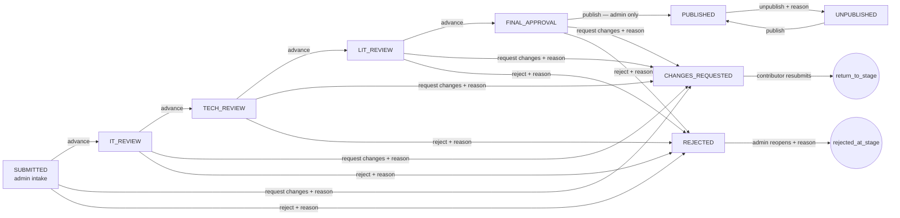

# IT Museum — India

Public archive and editorial review portal for the **IT Museum — India**, a partnership between CHRIST (Deemed to be University), Bangalore Yeshwanthpur Campus, and the [DataArt IT Museum](https://museum.dataart.com/). It documents India's contributions to the history of computing through peer-reviewed research and curated exhibits.

- **Public site:** home, archive (search and filters), article/exhibit pages, team, visit & contact, guided submission, and submission status lookup.
- **Review portal (`/admin`):** role-based queues, an article workspace, a decision workflow with an immutable audit log, final publication, archive management, and staff roles.

## Architecture

```
Browser (React 19 + Vite 7 + TypeScript)
 ├─ public pages ── anon key ──► Supabase: view `published_articles`, table `sections` (read-only)
 ├─ public pages ──────────────► Firebase Firestore `collections` (legacy notes, read-only)
 ├─ submission / status ───────► Edge Function `public-api`  (no login; reference + access key)
 └─ /admin ── Firebase Auth ID token ──► Edge Function `staff-api`
                                          │ verifies the token (JWKS) → explicit staff_members role
                                          │ shared rules: supabase/functions/_shared/workflow.ts
                                          ▼ service role (server-side only)
                                 Postgres: articles, article_events, staff_members, notification_outbox
                                 Storage:  reports (private) · publication-staging (private) · articles (public PDFs)
                                          │
                                 Edge Function `notify-worker` ──► EmailJS REST (server-side) with retries
```

- **Source of truth:** Supabase Postgres holds articles, workflow state, the audit log and staff roles. Firebase is used only for staff **sign-in** and for the legacy Firestore `collections` notes, which are shown read-only in the archive (see [Content sources](#content-sources)).
- **Trust boundary:** browsers can only read published content. Every privileged read and write goes through the Edge Functions, which use the service-role key on the server. The workflow rules live in `supabase/functions/_shared/workflow.ts`. The same module drives the UI (to decide which buttons to show) and the server (to enforce them), and the tests cover it.
- **Concurrency:** every write calls `apply_article_change(...)`, which checks the expected `status` and `version` (compare-and-swap). The status change, the audit event and the queued notifications commit in one transaction. A second decision made from a stale screen is rejected with "this article changed".

### Repository layout

| Path | Contents |
| --- | --- |
| `src/pages/` | Public routes |
| `src/admin/` | Review portal (auth, overview, queue, workspace, publication, archive, staff) |
| `src/components/` | Layout, UI kit, archive, submission components |
| `src/services/` | Archive, sections and submission clients |
| `src/content/` | Institutional copy: site/contact, team credits, exhibits |
| `src/styles/` | Design tokens and styles — see [docs/design-system.md](docs/design-system.md) |
| `supabase/functions/` | Edge Functions (`public-api`, `staff-api`, `notify-worker`) and `_shared` logic |
| `supabase/migrations/` | Versioned SQL migrations |
| `supabase/rollback/` | Rollback scripts |
| `supabase/inspect_production.sql` | Read-only inspection to run **before** migrating |
| `tests/` | Workflow, validation, service journey and migration/RLS tests |
| `firestore.rules` | Recommended read-only rules for the legacy `collections` |

## Local setup

Requirements: Node 20+ and npm. Running the Edge Functions locally also needs the [Supabase CLI](https://supabase.com/docs/guides/cli) and Docker.

```bash
npm ci
cp .env.example .env            # fill in values (names below)
npm run dev                     # http://localhost:5173
```

Without Supabase/Firebase values the site still renders: the archive shows the curated exhibit and clear error states, and `/admin` explains what is missing.

### Environment variables (names only)

Frontend (`.env`, public — bundled into the browser):

| Variable | Purpose |
| --- | --- |
| `VITE_SUPABASE_URL`, `VITE_SUPABASE_ANON_KEY` | Public read access and Edge Function base URL |
| `VITE_FUNCTIONS_URL` | Optional override for the functions base URL |
| `VITE_FIREBASE_API_KEY`, `VITE_FIREBASE_AUTH_DOMAIN`, `VITE_FIREBASE_PROJECT_ID`, `VITE_FIREBASE_STORAGE_BUCKET`, `VITE_FIREBASE_MESSAGING_SENDER_ID`, `VITE_FIREBASE_APP_ID` | Staff sign-in and Firestore |
| `VITE_FIREBASE_MEASUREMENT_ID` | Optional; analytics is not initialised by this app |
| `VITE_SITE_URL` | Canonical site URL used in citations |

Edge Functions (`supabase/functions/.env`, **secret**, set with `supabase secrets set --env-file supabase/functions/.env`). See `supabase/functions/.env.example`:

| Variable | Purpose |
| --- | --- |
| `FIREBASE_PROJECT_ID` | Audience/issuer for verifying staff ID tokens |
| `ALLOWED_ORIGINS` | Comma-separated CORS allow-list |
| `PUBLIC_SITE_URL` | Links in contributor emails |
| `EMAILJS_SERVICE_ID`, `EMAILJS_TEMPLATE_ID`, `EMAILJS_PUBLIC_KEY`, `EMAILJS_PRIVATE_KEY` | Server-side email delivery |
| `NOTIFY_CRON_SECRET` | Lets a scheduler trigger notification retries |
| `RATE_LIMIT_SALT` | HMAC secret for the hashed IP/email keys of the abuse limits (falls back to a key derived from the service role key) |
| `ACCESS_KEY_SECRET` | HMAC secret that lets a retried submission show the same access key again (same fallback) |
| `SUPABASE_URL`, `SUPABASE_SERVICE_ROLE_KEY` | Injected by Supabase; **never** put the service key in a `VITE_` variable |

## Commands

| Command | What it does |
| --- | --- |
| `npm run dev` | Vite dev server |
| `npm run build` | Type-check (`tsc -b`) and production build to `dist/` (not committed) |
| `npm run preview` | Serve the production build |
| `npm test` | Vitest: workflow rules, validation, service journey, **real SQL migrations on PGlite**, UI and accessibility tests |
| `npm run lint` | ESLint |
| `npm run typecheck` | TypeScript only |
| `npm run check:functions` | Type-check the Deno Edge Functions |

## Data model

`public.articles` (existing table, extended — no columns removed):

| Column | Notes |
| --- | --- |
| `id`, `title`, `description`, `keywords`, `tags` | Existing |
| `author_name`, `institution_email`, `author_designations`, `num_authors` | Existing comma-joined columns, still filled for compatibility |
| `authors` (jsonb) | Structured `[{name, email, designation}]` |
| `submitted_email`, `originality_confirmed` | Existing |
| `status` | Canonical enum (below), CHECK-constrained |
| `version` | Incremented on every change (optimistic concurrency) |
| `reference_code` | `ITM-YYYY-XXXXXX`, or `ITM-LEGACY-…` for migrated rows |
| `legacy_status` | The status a migrated row had before 2026-10 |
| `return_to_stage`, `rejected_at_stage`, `public_reason` | Revision and rejection bookkeeping (`public_reason` is shown to the contributor) |
| `file_url` | **Legacy column, never overwritten.** For old rows it holds a Google Doc link or a published PDF URL |
| `manuscript_url` | Contributor's Google Doc/Drive link |
| `similarity_report_path`, `ai_report_path` | Objects in the private `reports` bucket (legacy `*_report_url` columns are kept) |
| `staged_pdf_path` | Final PDF in private `publication-staging` |
| `published_pdf_path`, `published_pdf_url` | Public copy in the `articles` bucket while published |
| `assignee_id` → `staff_members.id` | Optional assignment |
| `contributor_token_hash` | SHA-256 of the contributor's access key (the key itself is never stored) |
| `stage_entered_at`, `updated_at`, `published_at`, `unpublished_at` | Timestamps |

Other objects:

- `article_events`: an append-only audit log (a trigger blocks updates and deletes). It records actor, role, action, from/to status, reason, visibility (`internal`/`contributor`) and metadata. Internal notes are events of type `note`.
- `staff_members`: `email`, `display_name`, `role` (`admin` | `it_reviewer` | `tech_reviewer` | `lit_reviewer`), `active`, and the linked `firebase_uid`.
- `notification_outbox`: contributor emails queued in the same transaction as the change.
- `published_articles` (view): the only article data browsers can read. It contains published rows and public columns only.
- `sections`: homepage CMS sections, public read-only, sanitised before rendering.
- `authorized_users`: the old login table. Data is kept but locked, and it is no longer used for authorisation.

## Workflow

Statuses name the **queue an article is waiting in**:

`SUBMITTED` → `IT_REVIEW` → `TECH_REVIEW` → `LIT_REVIEW` → `FINAL_APPROVAL` → `PUBLISHED`, plus `CHANGES_REQUESTED`, `REJECTED` and `UNPUBLISHED`.



- A resubmitted revision makes **one** transition, back to the stage that requested it (`return_to_stage`).
- Reopening returns a rejected article to the stage that rejected it. Legacy rejections with an unknown stage return to `SUBMITTED`.
- Stages cannot be skipped: `advance` always moves exactly one stage.
- Request changes, reject, unpublish and reopen all require a reason (10+ characters). Reasons for request-changes and reject are emailed to the contributor; the others stay internal.
- Publishing requires the checklist: title, author credit, abstract, at least one tag, and a final PDF.

### Role matrix

| Role | Works queue | May do |
| --- | --- | --- |
| Admin | `SUBMITTED`, `FINAL_APPROVAL`; sees every status | Advance from intake, request changes, reject, upload/replace the final PDF, edit public metadata and tags, **publish / unpublish**, reopen, assign, manage staff |
| IT reviewer | `IT_REVIEW` | Annotate, request changes, reject, advance to technical review |
| Technical reviewer | `TECH_REVIEW` | Annotate, request changes, reject, advance to literature review |
| Literature reviewer | `LIT_REVIEW` | Annotate, suggest tags, request changes, reject, advance to final approval. **Cannot publish** |
| Contributor | own submission (reference + access key) | Submit, see safe status and reviewer reason, resubmit a requested revision. Never sees internal notes |

Reviewers can only open articles in their own queue. Anything else returns "not found".

### Contributor access

On submission the contributor receives a **reference** and a one-time **access key**. They also get a confirmation email, which includes the reference but not the key. Both are needed at `/submission/status`. Only a hash of the key is stored. Legacy submissions have no key, so the museum answers those by email.

**Retries are safe.** The form sends an idempotency key (a `crypto.randomUUID()` kept in the tab's `sessionStorage` until the submission succeeds). If the response is lost and the contributor selects **Try again**, the server finds the key (`submission_idempotency`, hashes only), creates nothing, queues no second email, and returns the original reference. The access key is derived as `HMAC(ACCESS_KEY_SECRET, idempotency key)`, so for 24 hours a retry can show the same key again without it ever being stored. After that, or if the secret was rotated, the page shows the reference and asks the contributor to email the museum. A reused key with changed details gets `409 IDEMPOTENCY_MISMATCH`, and the next try counts as a new submission.

### Abuse limits

The public endpoints need no sign-in, so they are limited on the server (`_shared/abuse.ts`, counted atomically by `consume_rate_limit()` from migration 0005):

| Endpoint | Limit |
| --- | --- |
| `submit` | 20 per client IP per hour, 50 per IP per day, **5 per submitter address per day**, 300 in total per day |
| `resubmit` | 10 per client IP per hour |
| `status` (reference + access key) | 60 per client IP per 10 minutes |

- Over a limit, the API answers `429` with `Retry-After`, and the page explains how long to wait. Nothing is stored and no email is queued.
- The client IP is `cf-connecting-ip`, or else the **last** `x-forwarded-for` entry. The first entry can be set by the client. IPv6 is counted per /64. IPs and addresses are HMAC'd with `RATE_LIMIT_SALT` before they reach the database. `+tags` and Gmail dots are folded, so one mailbox has one budget.
- The confirmation email uses a fixed text: the reference and the status link, never the submitted title or names. The form therefore cannot deliver text an attacker wrote. The submitter address must be exactly one address.
- **Residual risk:** there is no email verification. Anyone can still have up to 5 fixed-text confirmations a day sent to an address they do not own, and a botnet with many IPs can use up the daily total (300 submissions, 20 MB each). Then real contributors see a "try again later" message until the next UTC day. Tighten the numbers in `RATE_LIMITS` if that happens, or add a verify-before-notify step or a CAPTCHA.
- **Clean-up:** finished windows of a key are deleted when that key is next counted. To purge the rest, and idempotency keys older than 7 days, run `select public.purge_abuse_controls();` daily (for example, `select cron.schedule('itm-purge-abuse', '17 3 * * *', 'select public.purge_abuse_controls()');` with pg_cron). Nothing breaks without it; the tables just grow slowly.

### Notifications

Workflow writes queue rows in `notification_outbox` inside the same transaction. The APIs then call `notify-worker`, which claims due rows (`FOR UPDATE SKIP LOCKED`) and sends through the EmailJS REST API using the private key on the server. Failures retry with backoff (1, 5, 25, 125 minutes; 5 attempts maximum). Schedule a retry run every 10 minutes, for example with Supabase cron or any scheduler:

```bash
curl -X POST "$SUPABASE_URL/functions/v1/notify-worker" -H "x-cron-secret: $NOTIFY_CRON_SECRET"
```

The EmailJS template should render `{{subject}}` and `{{message}}`, sent to `{{to_email}}`. Enable "Allow EmailJS API for non-browser applications" in the EmailJS account.

## Granting access

1. Create the person's email/password account in **Firebase Authentication** (or let them sign in with an existing one).
2. Add them in **/admin → Staff & roles** with exactly one role. The first admin must be created in SQL:

   ```sql
   insert into public.staff_members (email, display_name, role, active)
   values ('someone@christuniversity.in', 'Full Name', 'admin', true);
   ```

   On first sign-in the Firebase account is linked to this record. Roles are **never** inferred from email wording, and an unknown account gets no access.
3. The migration copies people from the old `authorized_users` table as **inactive** records, with the role their email pattern implied. Review them, then set `active = true` for the correct ones.

## Database migration runbook

The production schema was hand-built and is not recorded in the repo. Do **not** skip step 1.

1. **Inspect:** run `supabase/inspect_production.sql` in the SQL editor and save the output. Compare the columns, statuses, policies and buckets with `20261008000100_baseline_existing_schema.sql`. Adjust the baseline if production differs (for example, a different status column type or extra policies).
2. **Back up:** take a database backup (Dashboard → Database → Backups, or `pg_dump`) and download the `reports` and `articles` buckets. Migration 0002 also copies `articles`, `sections` and `authorized_users` into the `migration_backup` schema.
3. **Apply:** `supabase link --project-ref <ref>`, then `supabase db push`. Applies `0001` → `0005`. Each file is idempotent. `0003` records every policy it drops (and the previous grants, RLS flags and bucket settings) in `migration_backup.pre_0003_*`. On `storage.objects` it drops only policies that name the `articles`, `reports` or `publication-staging` buckets. Policies that are open across every bucket stay in place, and a restrictive policy keeps browser roles out of the three museum buckets. Read its NOTICE output. `0004` adds query indexes, pins `search_path` on the `SECURITY DEFINER` functions, blocks `TRUNCATE` of the audit log, and refuses any staff change that would leave no active admin (the API answers `409 LAST_ADMIN`).
4. **Deploy functions:** `supabase functions deploy public-api staff-api notify-worker` and set the secrets.
5. **Create the first admin** (see above). Deploy `firestore.rules` after reviewing the current rules.
6. **Deploy the frontend** (`npm run build`, then host `dist/` with SPA fallback to `index.html`).
7. **Verify:** published articles still appear. `/admin` signs in. A test submission arrives with a reference. The private report links open from the workspace only.

`0005` adds the abuse-limit counters, submission idempotency keys and `purge_abuse_controls()` (see "Abuse limits").

**Rollback:** run `supabase/rollback/20261008000500_down.sql` (roll the functions back first), then `20261008000400_down.sql`, then `20261008000300_down.sql`, then `20261008000200_down.sql`.

- **0003 rollback:** recreates the dropped policies, grants, RLS flags and bucket settings from `migration_backup.pre_0003_*`. It never reopens 0002's tables (`staff_members`, `article_events`, `notification_outbox`). On `articles`, it grants access only to the columns that existed before 0002, so `contributor_token_hash`, report paths and other new columns stay closed. As a result, the previous frontend's `select('*')` on `articles` gets "permission denied". To use that frontend again, an admin must run `grant select on public.articles to anon` by hand, knowing it exposes those columns. If no capture exists, the rollback applies a minimal state instead: public columns of `PUBLISHED` articles and the sections only.
- **0002 rollback:** puts status values back from `legacy_status`. It **refuses to run** if workflow activity happened after the migration, because resetting statuses would discard that progress. To proceed anyway, run `set itmuseum.rollback_discard_workflow = 'on';` first in the same session. The script first saves every article row to `migration_backup.articles_workflow_rollback`.
- **Re-applying 0002 after a rollback is safe.** Every row whose status is outside the new vocabulary is re-mapped, and existing reference codes are kept.

`file_url` and the report URL columns were never modified. A full restore is possible from `migration_backup.*` or the database backup.

### Legacy statuses

| Before | After | Notes |
| --- | --- | --- |
| `SUBMITTED` | `SUBMITTED` | |
| `ADMIN_APPROVED` | `IT_REVIEW` | |
| `IT_APPROVED` | `TECH_REVIEW` | |
| `TECH_APPROVED` | `LIT_REVIEW` | |
| `LIT_APPROVED` | `FINAL_APPROVAL` | Needs a final PDF before publishing |
| `PUBLISHED` | `PUBLISHED` | `published_at` unknown, so pages say "Added to archive" with the submission date |
| `IT_REJECTED` | `REJECTED`, stage `TECH_REVIEW` | The old Technical panel wrote `IT_REJECTED` |
| `TECH_REJECTED` | `REJECTED`, stage `LIT_REVIEW` | The old Literature panel wrote `TECH_REJECTED` |
| `LIT_REJECTED` | `REJECTED`, stage `LIT_REVIEW` | Not written by the old code; mapped by name |
| `ADMIN_REJECTED` | `REJECTED`, stage unknown | The old code used this for **both** admin triage and the IT panel |
| anything else | `SUBMITTED` | Returned to intake rather than hidden; the original value is kept in `legacy_status` |

Every migrated row gets an audit event of type `legacy_import`.

## Content sources

- **Research articles:** Supabase, through the review workflow.
- **Exhibits:** hand-curated pages in `src/content/exhibits.ts`, such as Kolam (Exhibit 001), presented as a heritage-and-computation exhibit.
- **Collection notes:** the legacy Firestore `collections` documents, displayed read-only and rendered as text. No admin screen writes them. Recommended next step: migrate them into Supabase as exhibits, or retire them.
- **Homepage sections:** the Supabase `sections` table, sanitised with DOMPurify. The old code read camelCase fields and never showed images or PDFs; this is now mapped correctly. Editing sections is not exposed in the portal; manage them in the Supabase dashboard until a secured CMS screen is built.

## Security notes

- `.env` and `dist/` are no longer tracked. The anon key and the EmailJS public identifiers were previously committed in `.env` and `Submission.tsx`. They are public by design, but **rotate the EmailJS keys** if the EmailJS account allowed browser sends to arbitrary recipients. Check the git history for anything else before making the repository public.
- The Firebase web config moved from `src/firebase-config.ts` to `VITE_FIREBASE_*` variables. It is not a secret, and it is not used for authorisation.
- Uploads are validated on the server by size and by PDF signature, not just by extension. Google Docs/Drive links are validated by their parsed host. This does **not** prove the reviewers have access, and the submission page explains that.

## Contact

Repository: [github.com/itmuseum-christuniversity/IT-Museum](https://github.com/itmuseum-christuniversity/IT-Museum) · Museum: itmuseum@christuniversity.in
