# IT Museum — Workflows

This page explains **how the whole website works, step by step**, using pictures. It covers what visitors, contributors, reviewers and the admin each do, and what the system does behind the scenes.

- Every picture is in `images/` (PNG, opens anywhere). The editable source of each picture is in `diagrams/` (Mermaid `.mmd` files).
- For setup, database and deployment details, see the main [README](../../README.md). For colours and components, see the [design system](../design-system.md).

### How to read the pictures

| Colour | Meaning |
| --- | --- |
| Dark navy | Start of a journey, or the admin / staff-only area |
| Blue | A normal page, screen or step |
| Gold | Contributor-facing step, or an important admin step |
| Green | Success, or something that goes live |
| Amber (hexagon) | A question or decision |
| Red | An error, a refusal, or a rejection |
| Grey | Background information or a side note |

## Contents

| # | Workflow | Who it is for |
| --- | --- | --- |
| **Part A — The public website** | | |
| 1 | [Site map and visitor journey](#1-site-map-and-visitor-journey) | Visitors |
| 2 | [Home page](#2-home-page) | Visitors |
| 3 | [Archive search and record page](#3-archive-search-and-record-page) | Visitors |
| **Part B — Contributors** | | |
| 4 | [Submitting research](#4-submitting-research) | Contributors |
| 5 | [Checking status and sending a revision](#5-checking-status-and-sending-a-revision) | Contributors |
| **Part C — The review workflow** | | |
| 6 | [Article status machine](#6-article-status-machine) | Everyone |
| 7 | [Happy path: from submission to published](#7-happy-path-from-submission-to-published) | Everyone |
| 8 | [A reviewer's decision](#8-a-reviewers-decision) | Staff |
| 9 | [Publishing and unpublishing](#9-publishing-and-unpublishing) | Admin |
| 10 | [Email notifications](#10-email-notifications) | Everyone |
| 11 | [Two people deciding at once](#11-two-people-deciding-at-once) | Staff |
| 12 | [Migrating old records](#12-migrating-old-records) | Admin, IT team |
| **Part D — Access and security** | | |
| 13 | [Staff sign-in and access](#13-staff-sign-in-and-access) | Staff |
| 14 | [How the system fits together](#14-how-the-system-fits-together) | IT team |
| 15 | [Who can do what](#15-who-can-do-what) | Everyone |
| **Part E — The admin side** | | |
| 16 | [Admin portal journey](#16-admin-portal-journey) | Admin |
| 17 | [Admin intake](#17-admin-intake-submitted) | Admin |
| 18 | [Admin final approval and publication](#18-admin-final-approval-and-publication) | Admin |
| 19 | [Admin archive management](#19-admin-archive-management) | Admin |
| 20 | [Staff and roles](#20-staff-and-roles) | Admin |
| 21 | [Reviewer queue (IT, Technical, Literature)](#21-reviewer-queue-it-technical-literature) | Reviewers |
| | [Rules and limits cheat sheet](#rules-and-limits-cheat-sheet) | Everyone |

---

# Part A — The public website

## 1. Site map and visitor journey

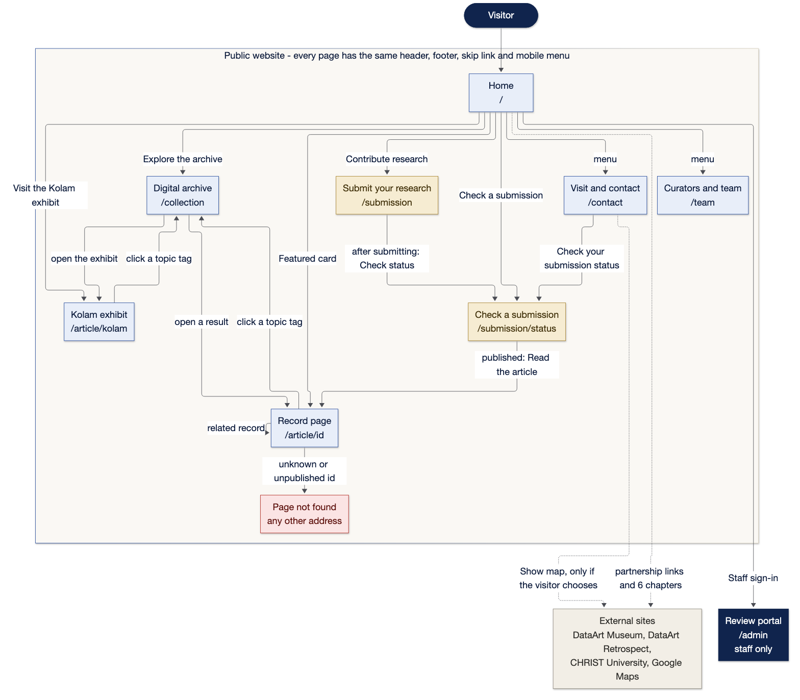

Every page shares the same header, footer, "skip to main content" link and phone menu. A visitor can reach every public page from Home. Record pages for articles that are not published show **Record not found** instead of a draft. The **Staff sign-in** link leads to the separate review portal.

| Page | Address | What it is for |
| --- | --- | --- |
| Home | `/` | Introduces the museum and the partnership |
| Digital archive | `/collection` | Search and browse everything published |
| Record page | `/article/<id>` | One article, exhibit or note |
| Kolam exhibit | `/article/kolam` | The hand-written heritage exhibit |
| Curators and team | `/team` | Mentors, coordinators, partners, editors, developers |
| Visit and contact | `/contact` | Address, email, phone, optional map |
| Submit your research | `/submission` | Guided submission |
| Check a submission | `/submission/status` | Contributor status and revisions |
| Review portal | `/admin` | Staff only |

## 2. Home page

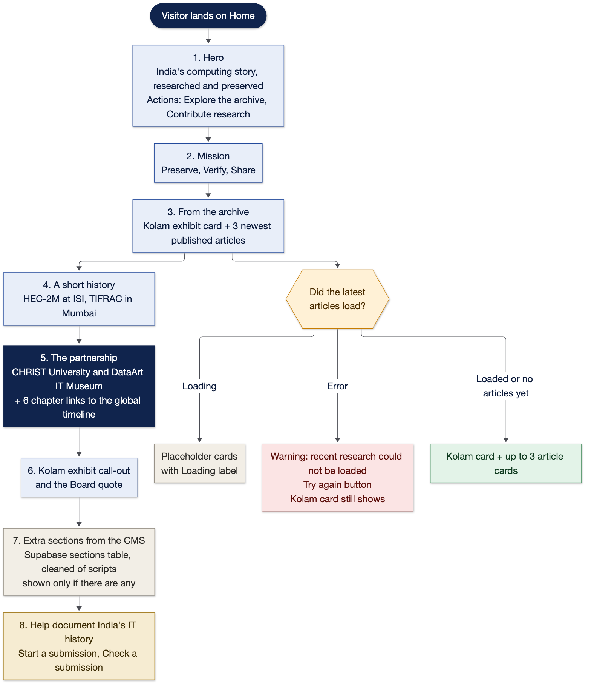

The Home page runs from the hero, through the mission and featured work, to the partnership and a closing call to contribute. The featured row always shows the Kolam exhibit. If the latest articles cannot load, a warning appears with **Try again**, and the exhibit is still shown. Extra sections from the CMS appear only if there are any.

## 3. Archive search and record page

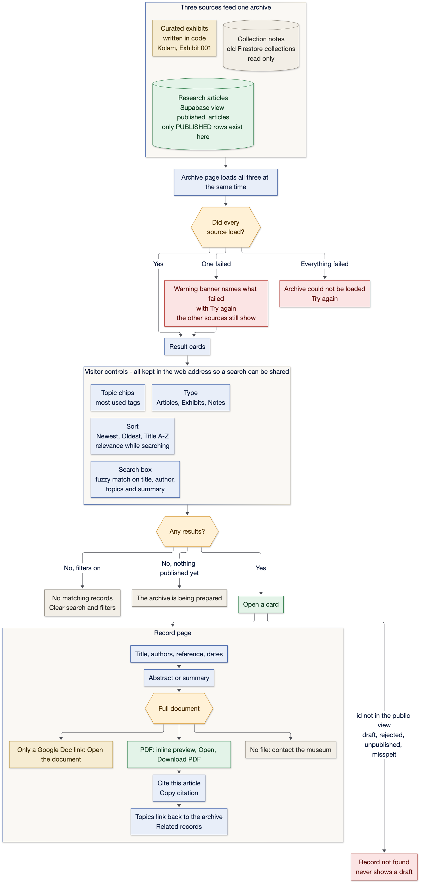

- **Three sources, one list:** published research articles, the hand-written exhibits, and the older collection notes.
- **One failure does not hide the rest.** A banner says what failed, with **Try again**.
- **Search is forgiving.** It matches title, author, topics and summary, even with small spelling mistakes.
- **Filters live in the web address**, so a search can be bookmarked or shared.
- **A record page** shows the abstract, the full document (PDF preview with Open and Download, or a Google Doc link, or a contact note), a **Copy citation** button, topic links back to the archive, and related records.

---

# Part B — Contributors

## 4. Submitting research

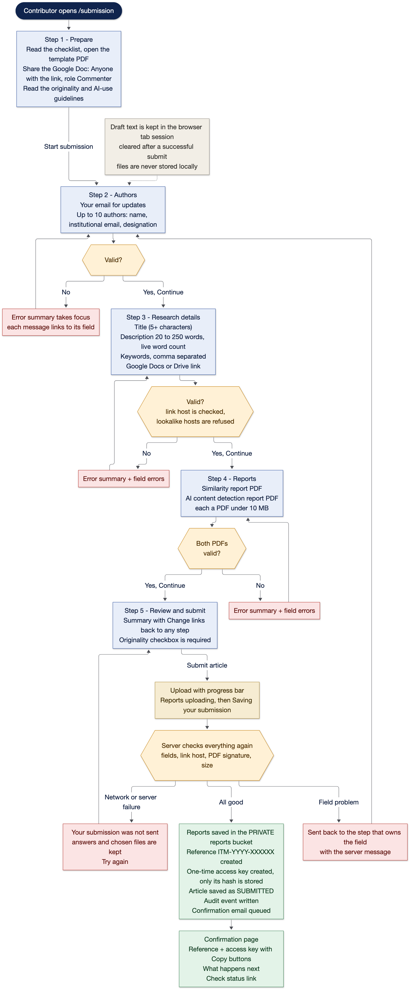

The form is split into five steps so nobody faces one long page.

1. **Prepare.** Checklist, template PDF, and how to share the Google Doc with **Commenter** access.
2. **Authors.** Your email for updates and up to 10 authors.
3. **Research details.** Title, description of 20–250 words, keywords, Google Docs or Drive link.
4. **Reports.** Similarity and AI-detection reports as PDFs under 10 MB each.
5. **Review and submit.** A summary with **Change** links, and the originality tick-box.

What helps the contributor:

- Mistakes are listed in one box at the top, and each message jumps to its field.
- The link is checked by its real address, so lookalikes such as `docs.google.com.evil.example` are refused.
- Typed answers are kept if the page is reloaded. Files are never stored in the browser.
- If the upload fails, the answers and chosen files are kept and **Try again** is offered.
- On success the contributor gets a **reference** (like `ITM-2026-K7Q2PA`) and a one-time **access key**. Only a scrambled version of the key is stored.

## 5. Checking status and sending a revision

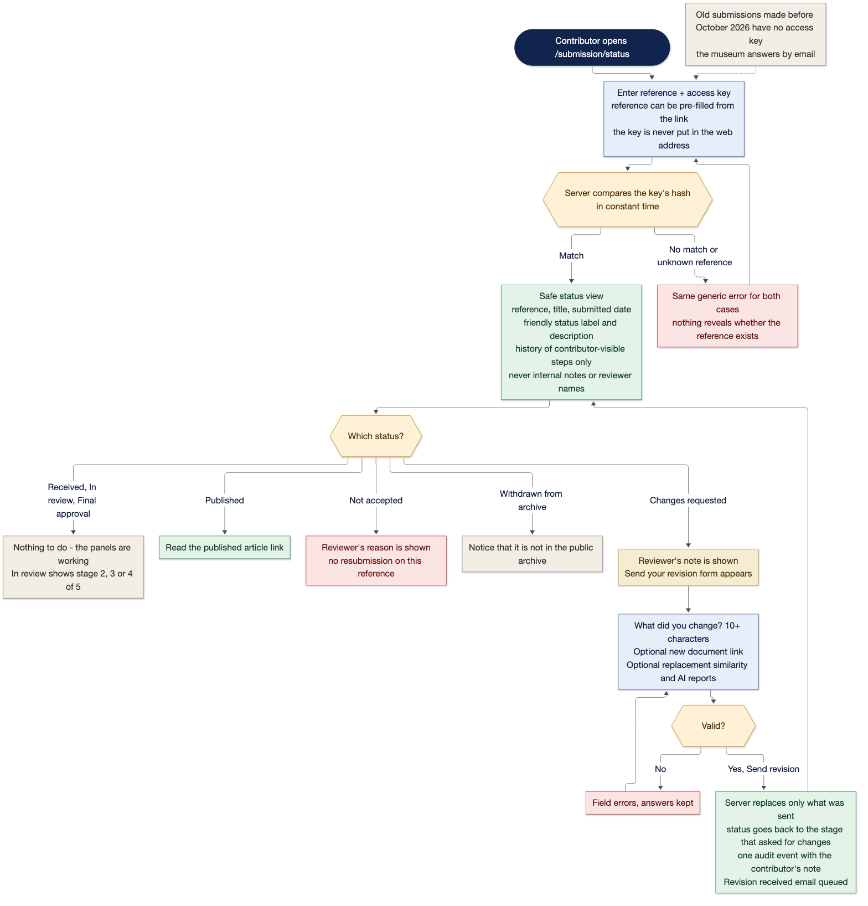

| What the contributor sees | When |
| --- | --- |
| Received | Waiting for the admin's intake check |
| In review (stage 2, 3 or 4 of 5) | With the IT, Technical or Literature panel |
| Final approval | Reviews done, the admin is preparing the decision |
| Changes requested | The reviewer's note is shown and a revision form appears |
| Not accepted | The reviewer's reason is shown |
| Published | A link to read the article |
| Withdrawn from archive | Currently not in the public archive |

A wrong reference and a wrong key give the **same** message, so nobody can use the page to find out which references exist. Contributors never see internal notes or reviewer names. When a revision is sent, the article goes straight back to the stage that asked for changes.

---

# Part C — The review workflow

## 6. Article status machine

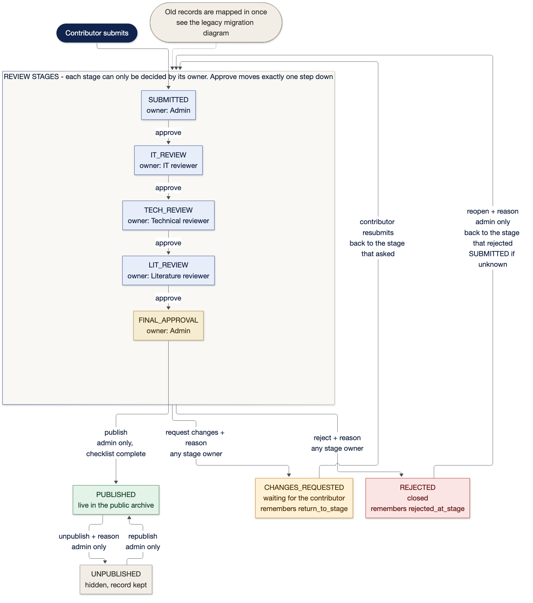

Every article is always in exactly one status. The status names the **queue the article is waiting in**.

| Status | Waiting for | Contributor sees | Emailed to contributor |
| --- | --- | --- | --- |
| `SUBMITTED` | Admin (intake) | Received | Submission received |
| `IT_REVIEW` | IT reviewer | In review | — |
| `TECH_REVIEW` | Technical reviewer | In review | — |
| `LIT_REVIEW` | Literature reviewer | In review | — |
| `FINAL_APPROVAL` | Admin | Final approval | — |
| `PUBLISHED` | — | Published | Published |
| `UNPUBLISHED` | — | Withdrawn from archive | Unpublished |
| `CHANGES_REQUESTED` | The contributor | Changes requested + reason | Changes requested + reason |
| `REJECTED` | — | Not accepted + reason | Rejected + reason |

The rules, all enforced on the server:

- Only the **owner** of a stage can decide it. Approve moves exactly **one** step forward, and no stage can be skipped.
- **Request changes** and **Reject** need a written reason of at least 10 characters.
- A revision returns to the stage that asked (`return_to_stage`).
- Reopening a rejected article returns it to the stage that rejected it (`rejected_at_stage`), or to `SUBMITTED` when that is unknown.
- Only the admin can publish, unpublish or reopen. Publishing needs the checklist to be complete.

## 7. Happy path: from submission to published

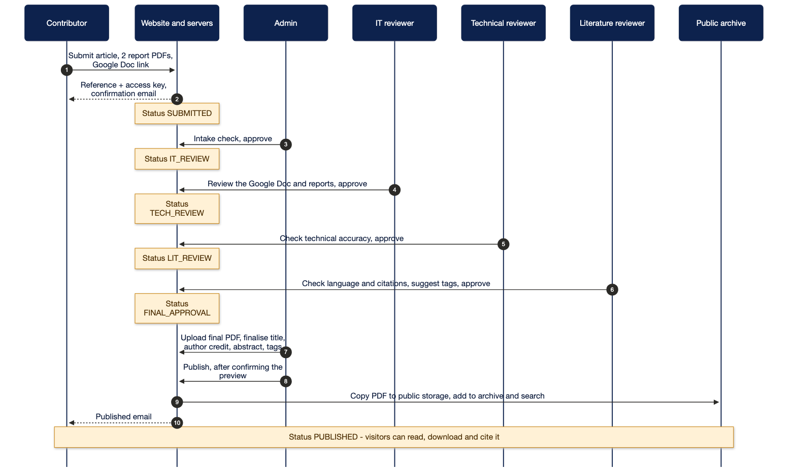

The same journey told as a conversation between the people and the system. Each grey step is the status the article has at that moment.

## 8. A reviewer's decision

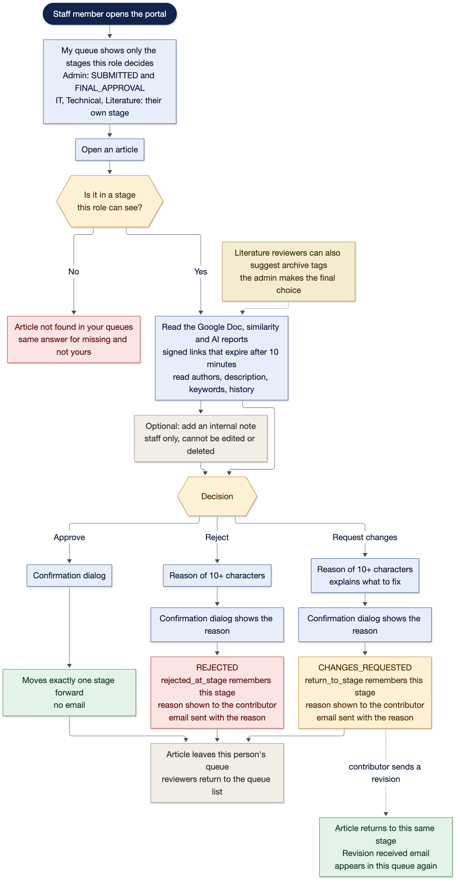

- Staff only see the stages their role decides. Anything else says **Article not found in your queues**, the same answer as for an article that does not exist.
- Report links are private and expire after 10 minutes. **Refresh** gets new ones.
- A **confirmation box** shows the reason before any decision is applied.
- After a decision the article leaves that person's queue.
- If the contributor revises, the article comes back to the same stage.

## 9. Publishing and unpublishing

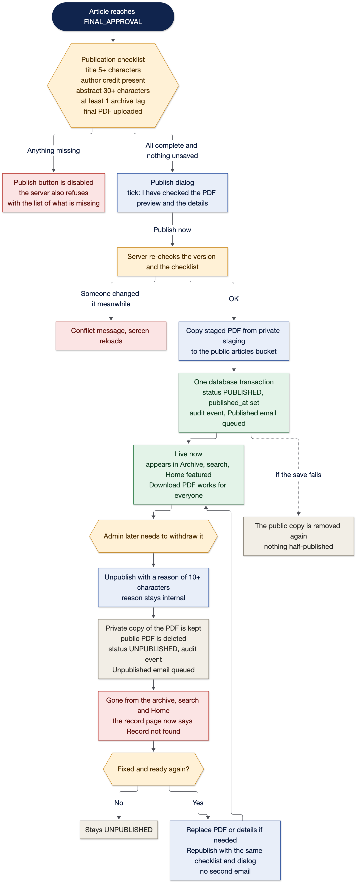

- Publishing is possible only when all five checklist items are done: title, author credit, abstract, at least one tag, and a final PDF.
- Publishing copies the PDF from private storage to public storage and saves the status, the audit entry and the email in one step. If saving fails, the public copy is removed again, so nothing is left half-published.
- **Unpublishing** keeps a private copy, deletes the public PDF and removes the article from the archive, search and Home.
- **Republishing** uses the same checklist and confirmation, and sends no second email.

## 10. Email notifications

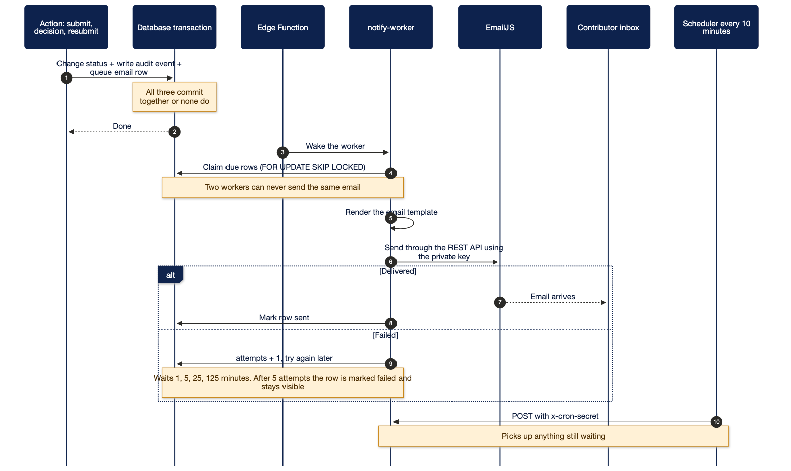

Emails are queued in the **same step** as the change that causes them, so a status can never change without its email being queued, and the other way round.

| Email | Sent when |
| --- | --- |
| Submission received | A new article is submitted |
| Changes requested | A reviewer or the admin asks for changes (includes the reason) |
| Rejected | An article is rejected (includes the reason) |
| Revision received | The contributor sends a revision |
| Published | An article is published for the first time |
| Unpublished | An article is withdrawn |

No email is sent for approvals, reopening, republishing, notes or assignments. If sending fails it is retried after 1, 5, 25 and 125 minutes, up to 5 attempts, and then marked failed where staff can see it.

## 11. Two people deciding at once

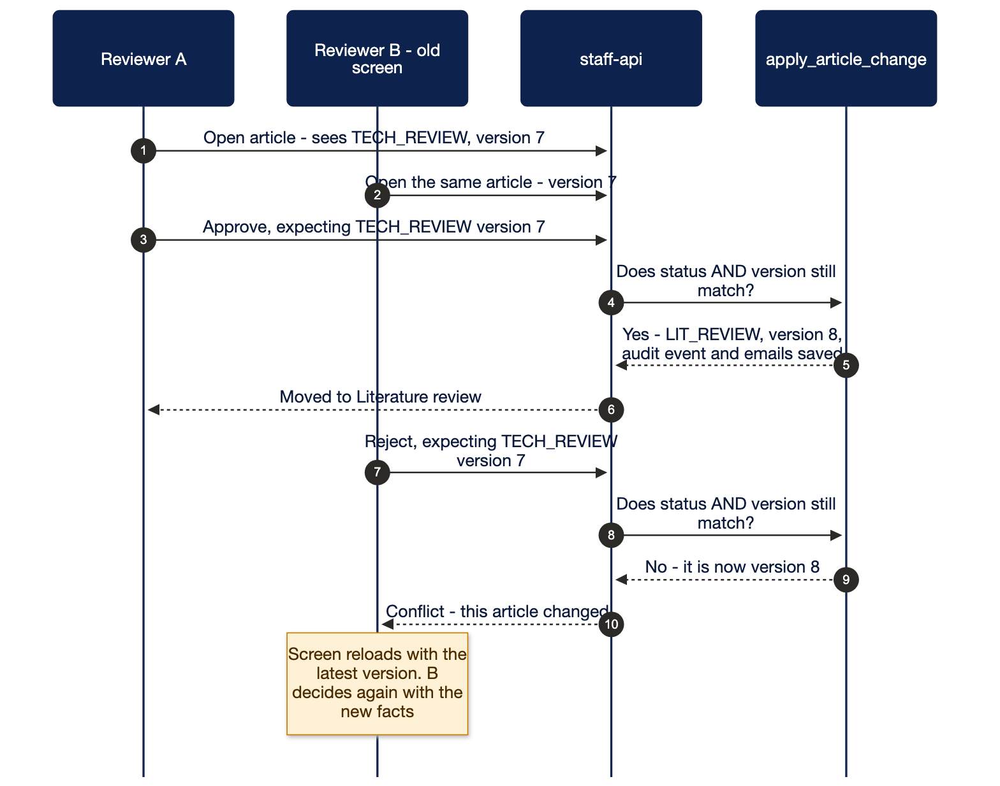

Every change says "I am acting on version 7 in status X". If someone else already changed the article, the second person gets a **conflict message**, the screen reloads, and they decide again with the latest facts. Nobody can overwrite a decision they have not seen.

## 12. Migrating old records

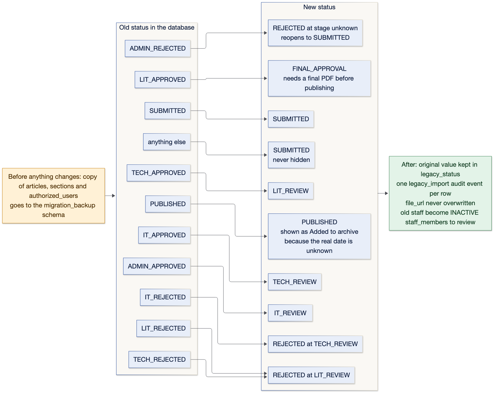

Old statuses are converted one by one. Nothing is lost: the original status is kept, every row gets an audit entry, the old file links are untouched, and a copy of the old tables is stored before anything changes.

---

# Part D — Access and security

## 13. Staff sign-in and access

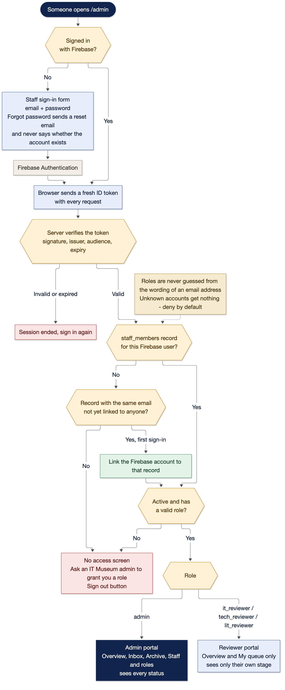

- Staff sign in with Firebase. The **server** checks every request's token.
- Access comes **only** from an explicit staff record with a role and an active flag. It is never guessed from the wording of an email address, and unknown accounts get nothing.
- On a person's first sign-in, their Firebase account is linked to the record the admin created with the same email.

## 14. How the system fits together

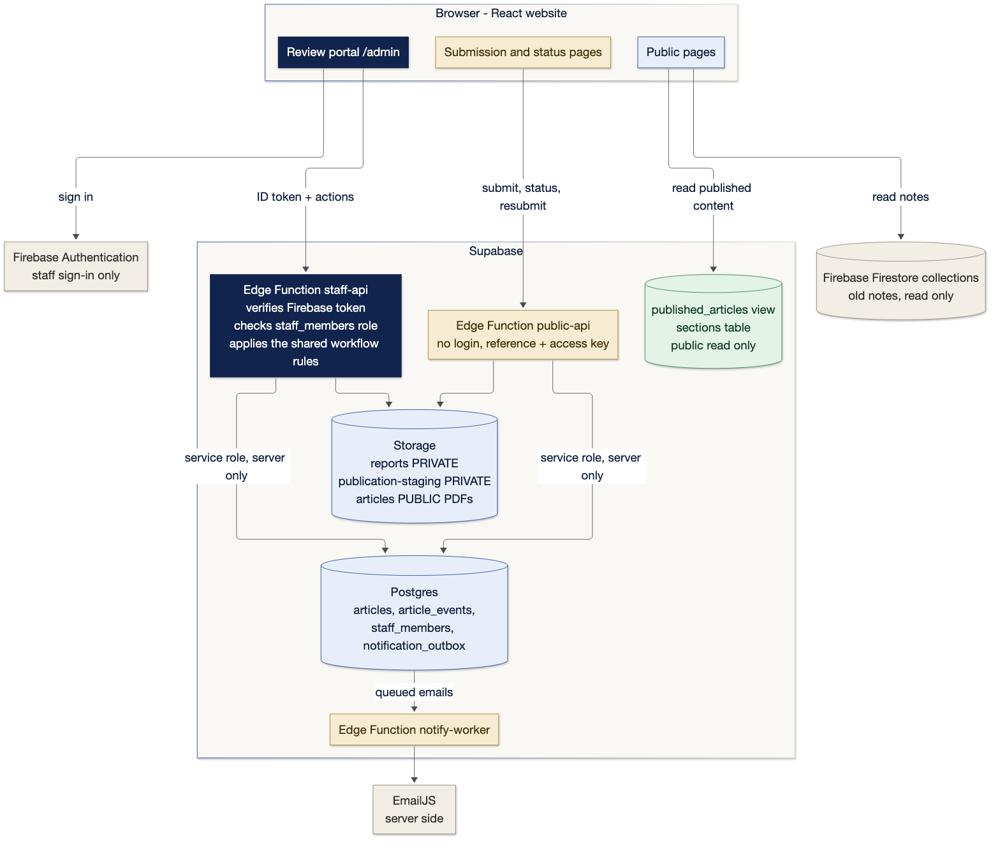

Browsers can only **read published content**. Everything else goes through server functions that hold the secret keys. The report PDFs are private; only published PDFs are public.

## 15. Who can do what

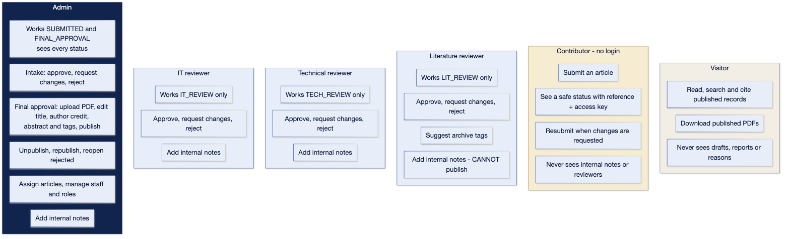

| Action | Admin | IT | Technical | Literature | Contributor | Visitor |
| --- | :-: | :-: | :-: | :-: | :-: | :-: |
| Read published records | ✔ | ✔ | ✔ | ✔ | ✔ | ✔ |
| Submit an article | | | | | ✔ | |
| Check own status / send revision | | | | | ✔ | |
| Decide `SUBMITTED` | ✔ | | | | | |
| Decide `IT_REVIEW` | | ✔ | | | | |
| Decide `TECH_REVIEW` | | | ✔ | | | |
| Decide `LIT_REVIEW` | | | | ✔ | | |
| Suggest archive tags | ✔ | | | ✔ | | |
| Add internal notes | ✔ | ✔ | ✔ | ✔ | | |
| Assign an article | ✔ | | | | | |
| Decide `FINAL_APPROVAL`, edit public details, upload final PDF | ✔ | | | | | |
| Publish / unpublish / republish | ✔ | | | | | |
| Reopen a rejected article | ✔ | | | | | |
| Manage staff and roles | ✔ | | | | | |
| See reports and internal notes | ✔ | stage only | stage only | stage only | | |

---

# Part E — The admin side

## 16. Admin portal journey

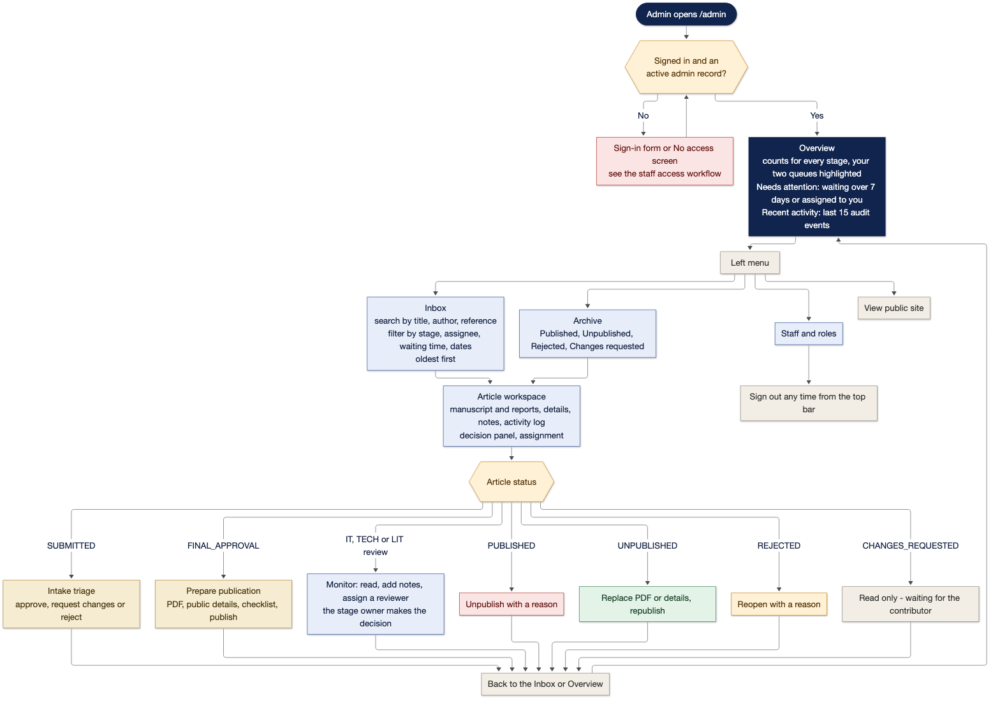

The admin portal has four places:

| Menu item | What it shows |
| --- | --- |
| **Overview** | A count for every status (the admin's own two queues highlighted), a **Needs attention** list (waiting over 7 days or assigned to you), and the last 15 pieces of activity |
| **Inbox** | The admin's queues by default. Search by title, author or reference, and filter by stage, assignee, waiting time and dates. Oldest first |
| **Archive** | Published, Unpublished, Rejected and Changes requested records |
| **Staff and roles** | Who has access and what role they have |

From any list the admin opens the **article workspace**. What the admin can do there depends on the article's status, as the middle of the picture shows.

## 17. Admin intake (`SUBMITTED`)

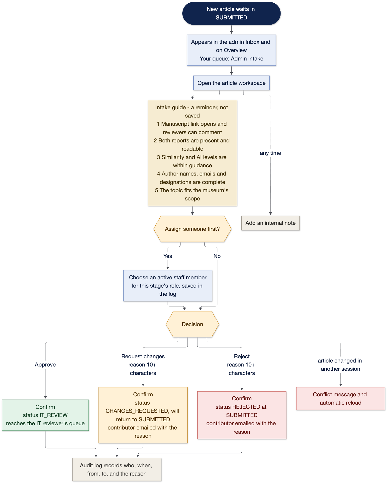

The intake guide is a reminder of the five things to check. It is not saved. The admin can assign the article, add a note, and then approve, request changes, or reject. Every decision opens a confirmation box and is written to the activity log with who, when and why.

## 18. Admin final approval and publication

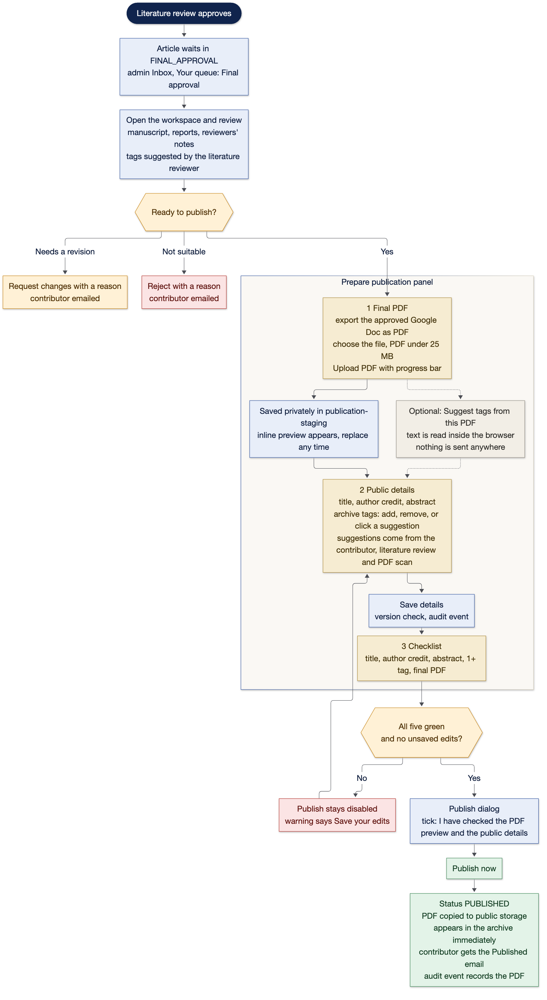

The **Prepare publication** panel has three parts:

1. **Final PDF.** Export the approved Google Doc as a PDF and upload it (up to 25 MB). It is stored privately and previewed. **Suggest tags from this PDF** reads the text inside the browser, and nothing is sent anywhere.
2. **Public details.** Title, author credit, abstract and tags. Suggestions come from the contributor's keywords, the literature reviewer and the PDF scan. **Save details** must be pressed before publishing.
3. **Checklist.** All five items must be green.

The **Publish** button stays disabled until everything is complete and saved, and then asks for a final tick-box confirmation.

## 19. Admin archive management

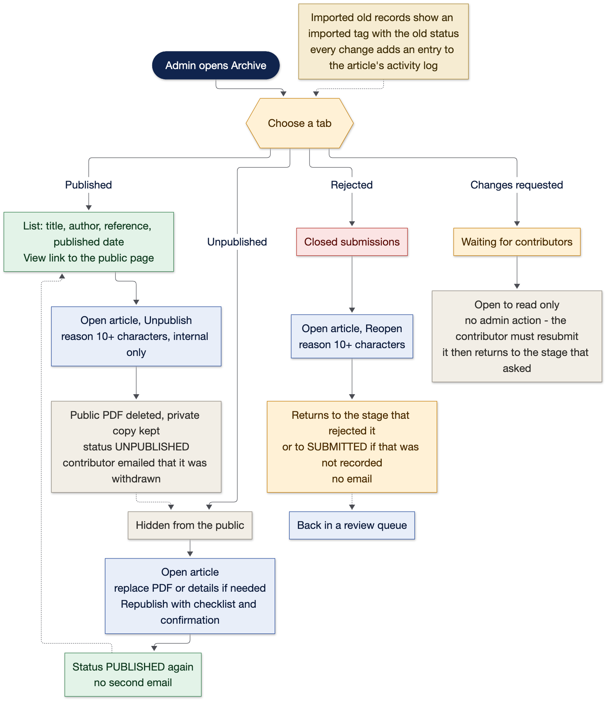

| Tab | Admin can |
| --- | --- |
| Published | Open the public page, or **Unpublish** with a reason |
| Unpublished | Replace the PDF or details, then **Republish** |
| Rejected | **Reopen** with a reason |
| Changes requested | Read only; the contributor must resubmit |

Records imported from the old system are tagged with their old status. Every change is added to the article's activity log.

## 20. Staff and roles

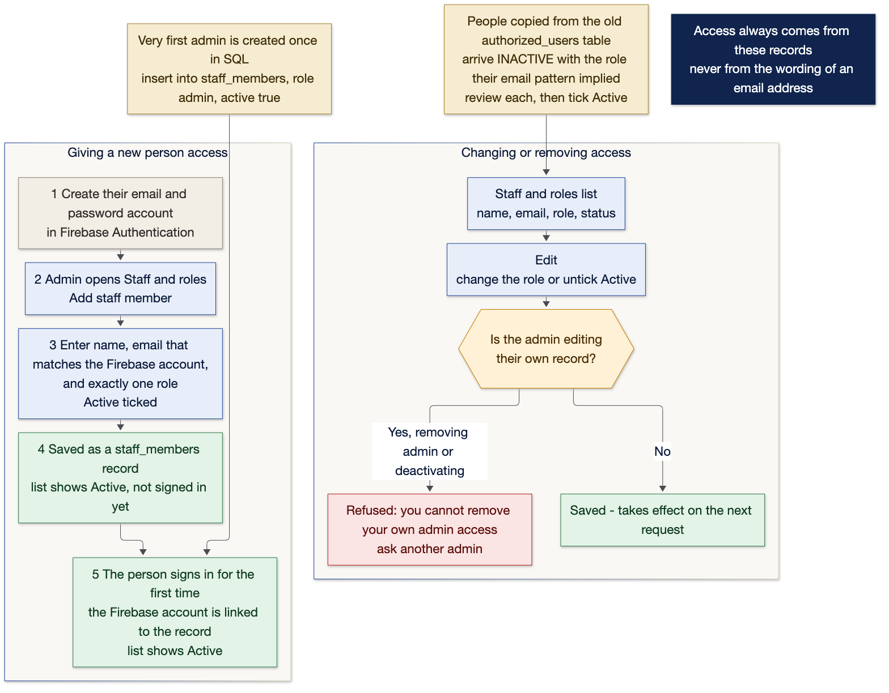

- To add someone: create their Firebase sign-in, then add them here with one role. The list shows **Active · not signed in yet** until they first sign in.
- To change a role or switch someone off, use **Edit**.
- **An admin cannot remove their own admin access**, so the museum can never be left without an admin.
- The very first admin is created once in the database. People copied from the old system arrive **inactive** and must be reviewed.

## 21. Reviewer queue (IT, Technical, Literature)

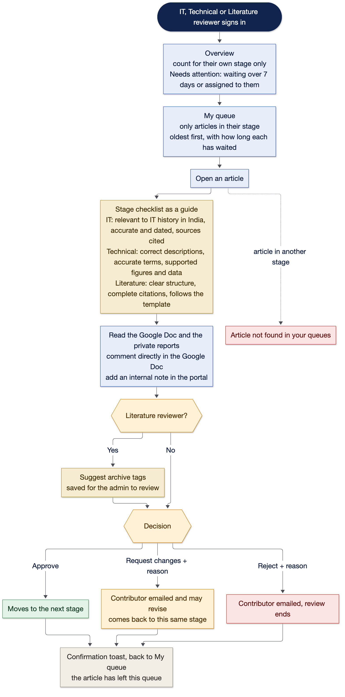

Reviewers see an Overview and **My queue** only. Each stage has its own guide:

- **IT:** relevant to the history of IT in India, accurate and dated, sources cited.
- **Technical:** correct descriptions, accurate terms, supported figures and data.
- **Literature:** clear structure, complete citations, follows the template. They also suggest archive tags for the admin.

Reviewers comment directly in the contributor's Google Doc and record decisions in the portal.

---

# Rules and limits cheat sheet

| Rule | Value |
| --- | --- |
| Authors per article | Up to 10 |
| Description length | 20 to 250 words |
| Title length | At least 5 characters (5 to 300 when edited by the admin) |
| Report PDFs | Two PDFs, up to 10 MB each |
| Final PDF | One PDF, up to 25 MB |
| Manuscript link | Google Docs or Google Drive only, checked by real address |
| Reason for request-changes / reject / unpublish / reopen | At least 10 characters |
| Revision note | 10 to 4000 characters |
| Internal note | Up to 8000 characters |
| "Needs attention" | Waiting more than 7 days, or assigned to you |
| Private report links | Expire after 10 minutes |
| Email retries | After 1, 5, 25, 125 minutes; 5 attempts maximum |
| Publication checklist | Title, author credit, abstract (30+ characters), 1+ tag, final PDF |

---

## Updating these pictures

Edit the `.mmd` file in `diagrams/`, then regenerate its image:

```bash
npx -y @mermaid-js/mermaid-cli -i docs/workflows/diagrams/06-status-state-machine.mmd \
  -o docs/workflows/images/06-status-state-machine.png \
  -c docs/workflows/diagrams/_config.json --scale 2 -b white
```

If the status rules in `supabase/functions/_shared/workflow.ts` change, update picture 6, the tables in sections 6 and 15, and the tests in `tests/workflow.test.ts` together.
