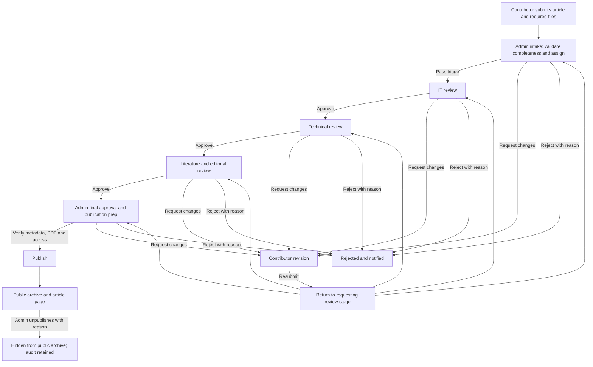

# IT Museum — complete website redesign and admin workflow rebuild

> Implementation brief for Claude. Work in this repository, implement the finished site, and update this checklist as work is completed. The requested deliverable is a working application, not mockups alone.

## Model and goal

Use **Claude Opus 5.5** (`claude-opus-5-5`) for this end-to-end job. The repository needs coordinated design, data, security, and workflow changes; Anthropic lists Opus 5.5 for long-running agentic coding. If it is unavailable in the user's Claude environment, use the newest available Claude Opus; Claude Sonnet 5.5 is the faster alternative. Model reference: [Anthropic's models overview](https://platform.claude.com/docs/en/models/overview).

Rebuild the entire public website and admin portal with a coherent, modern, professional museum identity. Preserve the Christ University/DataArt partnership, existing research content, team credits, logos, and article data. Make the submission-to-publication process understandable to contributors and enforceable for staff. The admin must make the final publication decision.

## Repository audit (current code, not just README)

| Area | Existing implementation | Required attention |
| --- | --- | --- |
| Stack | React 19, TypeScript, Vite 7, React Router; CSS in `src/index.css`, `src/home-enhancements.css`, and many inline styles | Keep the stack unless a change has a clear migration benefit; build shared design tokens and components. |
| Public routes | `/`, `/collection`, `/article/:id`, `/team`, `/contact`, `/submission` in `src/App.tsx` | Redesign every route, including loading, empty, error, and narrow-screen states. Add a proper not-found route. |
| Home | `src/pages/Home.tsx` combines IT history and traditional geometric-art messaging, a hero carousel, DataArt links, and Supabase sections | Establish one clear editorial story for the IT Museum in India; retain relevant heritage/computation content as a deliberate exhibit, not a competing mission. |
| Archive | `src/pages/Collection.tsx` lists Supabase `PUBLISHED` articles with Fuse search, a hardcoded Kolam card, and separate Firebase Firestore collections | Define a single understandable taxonomy/search experience and decide how to present or migrate the second collection source without losing data. |
| Article | `src/pages/Article.tsx` has a hardcoded `/article/kolam` exhibit and a dynamic PDF view | Keep the exhibit if appropriate; show publication date, citation, metadata, and PDF access accurately. Restrict dynamic public detail to published records. Remove the misleading “secure view mode” badge on a downloadable/public PDF. |
| Submission | `src/pages/Submission.tsx` collects 1–10 authors, title, description, keywords, Google Doc/Drive link, originality confirmation, and similarity/AI PDF reports | Preserve these fields and template PDF; create a clear guided flow, accessible validation, upload progress, confirmation/reference, and help for document permissions. Confirm institutional AI policy copy before treating its 5% figure as a system rule. |
| Admin | `src/pages/Admin.tsx`, `src/components/admin/ReviewPanel.tsx`, `KeywordExtractor.tsx` | Replace the single overloaded screen with role-aware queues, article workspace, timeline, review decisions, and a final admin publishing workspace. |
| Data/services | Supabase `articles`, `sections`, storage buckets `articles` and `reports`; Firebase Auth and Firestore `collections`; EmailJS sends from the browser | Document the source of truth, add schema/migrations and secure server-side transitions. Keep existing records and files accessible during migration. |
| Styling/navigation | Current blue/gold styling and many inline rules; `.nav-links` is hidden at `max-width: 768px` without a replacement | Introduce responsive navigation and consistent typography, spacing, surfaces, controls, motion, and focus states. |
| Documentation/build | `README.md` describes outdated lowercase status values, a different review order, and a contact form that is not implemented. No tests or database migrations are present. `.env` and `dist/` are tracked. | Align docs with actual architecture. Provide an `.env.example`, review tracked config for secrets, stop committing generated build output, and add focused tests. Do not print environment values in reports. |

The **actual current code path** is `SUBMITTED` → admin sets `ADMIN_APPROVED` → IT sets `IT_APPROVED` → technical sets `TECH_APPROVED` → literature sets `LIT_APPROVED` → literature's `KeywordExtractor` uploads a PDF and sets `PUBLISHED`. The README's lowercase statuses and “main admin final” description do not match this implementation. Rejection codes also vary by stage, and the literature role currently owns the last publishing action.

## Experience and visual direction

Create an editorial museum experience: thoughtful typography, strong hierarchy, generous whitespace, real imagery and archival cues, restrained Christ University blue with warm neutral surfaces and selective gold accents. Design public pages as a connected collection and the admin portal as a calm, information-dense work tool. Use the provided logos, hero photographs, portraits, and research template; optimize imagery and add accurate alt text. Avoid decorative motion that blocks reading or interaction.

Deliver a documented design system with color/spacing/type tokens, responsive breakpoints, buttons, links, cards, forms, tables, badges, alerts, dialogs, empty states, and skeleton/error states. Meet WCAG 2.2 AA where feasible: keyboard access, semantic landmarks, visible focus, sufficient contrast, labels and errors, reduced-motion support, and a usable mobile menu. Avoid `a` elements with only click handlers; use real links or buttons. Include page titles and metadata, accessible PDF fallback/download, and sensible behavior when external embeds are unavailable.

### Public site information architecture

| Route | Target experience |
| --- | --- |
| `/` | Distinct mission statement, featured research/exhibits, concise India IT history, partnership context, and obvious “Explore”/“Contribute” actions. |
| `/collection` | Unified archive cards with search and useful filters/tags, result counts, stable URLs, and clear empty/error states. Surface both Supabase articles and any retained Firestore collection content intentionally. |
| `/article/:id` | Readable article/exhibit layout, authors and citation, publication metadata, tags, document preview/download, related content, and a back path. Never expose a draft through the public route. |
| `/team` | Consistent portraits, roles, and accessible groupings using the current team data. |
| `/contact` | Verified location, phone, email links, and optional map with a text fallback. Implement a contact form only if a real delivery path is configured. |
| `/submission` | Step-by-step preparation and form: requirements/template → authors and research details → manuscript/report uploads → review/submit → confirmation and reference. Keep state/errors when an upload fails. |
| `/admin` | Sign-in and authenticated, role-specific work area. A contributor-facing status lookup may be added only if privacy-safe and useful. |

## New review and admin workflow

Use one canonical status enum that describes the **current queue**, rather than naming the last approver. Recommended statuses: `SUBMITTED`, `IT_REVIEW`, `TECH_REVIEW`, `LIT_REVIEW`, `FINAL_APPROVAL`, `CHANGES_REQUESTED`, `REJECTED`, `PUBLISHED`, `UNPUBLISHED`. Add `return_to_stage` (or equivalent) for revisions and `rejected_at_stage` for history. If a different naming scheme better fits existing data, document the exact mapping and keep the same transitions and permissions.

For the revision return, implement **one** transition to the recorded requesting stage; the fan-out above shows possible destinations, not five simultaneous transitions. Admin may reopen a rejected article with a reason and audit entry. Do not silently skip review stages. Final publication and unpublication belong to the admin role only.

| Role | Own queue | Allowed decisions |
| --- | --- | --- |
| Admin | `SUBMITTED`, `FINAL_APPROVAL`, published/archive management | Triage/assign, request changes, reject, final approve, upload/replace final PDF, edit publication metadata, publish/unpublish, reopen, manage role assignments and content. |
| IT reviewer | `IT_REVIEW` | Review subject matter, annotate, request changes, reject, advance to technical. |
| Technical reviewer | `TECH_REVIEW` | Check technical claims, annotate, request changes, reject, advance to literature. |
| Literature reviewer | `LIT_REVIEW` | Check writing/citations, annotate, request changes, reject, advance to final admin approval. May suggest keywords but cannot publish. |
| Contributor | Own submission, if authenticated or via a secure access method | Submit, see safe status/reason, provide requested revision. Cannot see internal comments or other submissions. |

Admin UI: overview cards for queue counts and items needing attention; searchable/filterable inbox (stage, age, assignee, date); article workspace with manuscript and private reports, metadata, authors, checklist, reviewer notes, decision form, and an immutable activity timeline; final-publication screen with PDF preview, editable tags/metadata, validation checklist, and an explicit publish confirmation. Make rejection versus request-changes distinct and require a reason. Show action success/failure, notify the contributor reliably, and prevent double decisions or stale overwrites.

## Data, permissions, and migration requirements

1. Inspect the actual deployed schema/buckets/policies before writing migrations. This repository has no SQL migrations, so do not assume README examples are the production schema. Add versioned migrations and documented rollback/backup steps; never discard existing articles, authors, reports, Google Doc links, section content, or Firestore collection data.
2. Migrate existing status values explicitly: `SUBMITTED` stays intake; `ADMIN_APPROVED` → `IT_REVIEW`; `IT_APPROVED` → `TECH_REVIEW`; `TECH_APPROVED` → `LIT_REVIEW`; `LIT_APPROVED` → `FINAL_APPROVAL`; `PUBLISHED` stays published. Preserve each legacy `*_REJECTED` state as a rejected item with its original stage in history. Handle already published records and absent fields. Keep original and final document URLs separately instead of overwriting `file_url`.
3. Replace `Admin.tsx`'s email-substring role inference and default-to-admin fallback with explicit role records and deny-by-default authorization. Firebase Auth can remain the sign-in provider, but privileged Supabase operations must go through a trusted server/edge layer that verifies Firebase ID tokens and role claims. Keep service-role credentials server-side only. Apply database/storage policies so anonymous users can read published content only; drafts, review notes, and reports are private. A name/email lookup from the browser is not sufficient authorization.
4. Make each approval/rejection/revision/publish/unpublish a validated server-side transition with current-status checks, role checks, audit event, actor ID, timestamp, and reason where required. Guard against concurrent reviewers. Design notification delivery to run after a committed transition, with retries/status; browser EmailJS alone is insufficient for authoritative workflow notifications.
5. Validate file type and size server-side; use private report storage and signed access for reviewers. Validate Google Docs/Drive hosts using parsed URLs, explain commenter access, and do not imply that a URL check proves permission. Keep the published PDF in an intentionally public or signed delivery path. Sanitize or render `sections.content` safely before displaying it.
6. Clarify the Firestore `collections` and Supabase `articles` relationship. Keep both only with a documented purpose, or migrate to one content model with a safe backfill. `DynamicHomeSections.tsx` expects camelCase image/PDF fields while `contentService.ts` defines snake_case; fix the mapping. Restore/administer editable homepage sections only if the new CMS experience is fully secured and tested.
7. Audit the tracked `.env` and generated `dist/`. Move example variable names to `.env.example`, ensure local secrets are ignored, and rotate any credential that was actually exposed. Never commit a Supabase service key or private signing secret to the frontend. Firebase web config and EmailJS public identifiers are not substitutes for authorization.

## Implementation checklist for Claude

- [x] Map current behavior and real database shape; record assumptions and migration plan. Keep a brief change log in the PR/hand-off.
  - _Code-derived schema only: the Supabase host in `.env` did not resolve (DNS) from this machine, so the live schema could not be inspected. `supabase/inspect_production.sql` must be run before migrating (README → runbook)._
- [x] Create the visual system and responsive public shell: header/menu, footer, typography, spacing, components, and accessibility defaults.
- [x] Rebuild every public route and its loading/empty/error states; preserve real institutional content and assets, fix inconsistent mission copy, and unify archive discovery.
- [x] Rebuild submission as a guided flow with safe validation, report uploads, clear document-access instructions, recoverable errors, confirmation/reference, and accessible controls.
- [x] Add trusted authorization/data layer, explicit roles, privacy policies, versioned schema/storage migrations, audit records, and safe workflow transitions.
- [x] Build separate admin overview, queue, review workspace, final publication, archive management, and any secured content-management screens needed for existing dynamic sections.
- [x] Implement the workflow diagram above end to end, including request changes/resubmission, rejection, publication, unpublication, notifications, and legacy-status migration.
  - _Homepage `sections` stay read-only (sanitised); editing them is not exposed in the portal (documented)._
- [x] Add focused tests for role permissions, status transitions, unpublished-content access, submission validation, and one complete submit → review → publish journey. Include at least one mobile navigation/accessibility check.
- [x] Update `README.md` with setup, environment variables (names only), data model, role matrix, workflow, deployment/migration instructions, and test commands. Resolve obsolete README claims.
- [ ] Verify `npm run build`, applicable tests/lint, and manual desktop/mobile flows. Report any infrastructure or credential-dependent checks that could not be run; do not mark them complete without evidence.
  - _Done locally: build, typecheck, lint, 83 tests (incl. migrations on PGlite), `deno check` of functions, Playwright screenshots of every route at 1280px and 390px with mocked data. **Not done:** migrations/functions against the real Supabase project, real Firebase sign-in, real email delivery (no access/credentials)._

## Definition of done

The public site looks and behaves as one polished museum product on desktop, tablet, and phone. Every existing route works, the archive displays only published items, submission succeeds or fails with clear feedback, and the admin has an intelligible queue and article workspace. Each role can only perform its own transitions; final publication is admin-only; rejection and revision are recorded and communicated; previously published data remains available. A new developer can set up and test the app from the README without guessing the schema or workflow.

When implementing, complete the code and migration files in this repository, verify locally, and leave a concise hand-off listing changed files, checks run, remaining external setup, and any decisions that require institutional confirmation.

## Hand-off (2026-10-08)

**Checks run:** `npm run build` ✔ · `npm run typecheck` ✔ · `npm run lint` ✔ · `npm test` ✔ (83 tests: workflow rules, validation, service journey, SQL migrations + RLS on PGlite, UI, axe) · `deno check` on all Edge Functions ✔ · Playwright screenshots of every route, desktop + phone, no horizontal overflow, no JS errors.

**Remaining external setup:** run `supabase/inspect_production.sql` and reconcile → back up → `supabase db push` → deploy the three functions and set their secrets → create the first admin in `staff_members` → activate the imported staff records → set up the EmailJS server template + private key → schedule `notify-worker` → review and deploy `firestore.rules`.

**Decisions needing institutional confirmation:**
1. The 5% AI-content figure is shown as guidance and is not enforced. Confirm the policy wording.
2. The museum mailbox `itmuseum@christuniversity.in` is unverified (campus address and phone were verified on christuniversity.in).
3. Legacy `ADMIN_REJECTED` rows have no known rejecting stage, so reopening them returns them to intake.
4. Legacy published items have no publication date and show "Added to archive".
5. The future of the Firestore `collections` notes: migrate them or retire them.
6. Whether to rotate the EmailJS keys that were previously committed.
